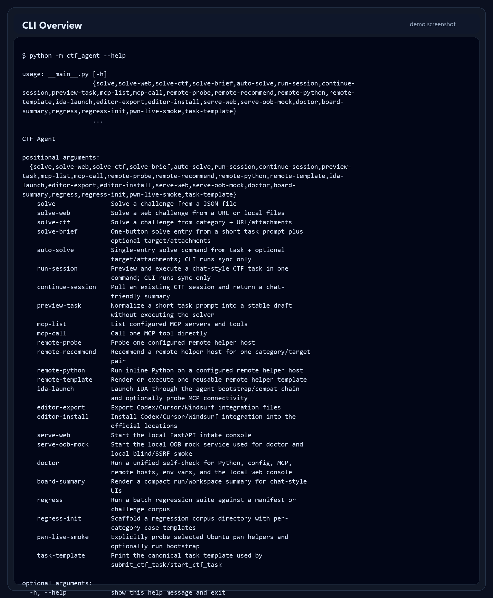
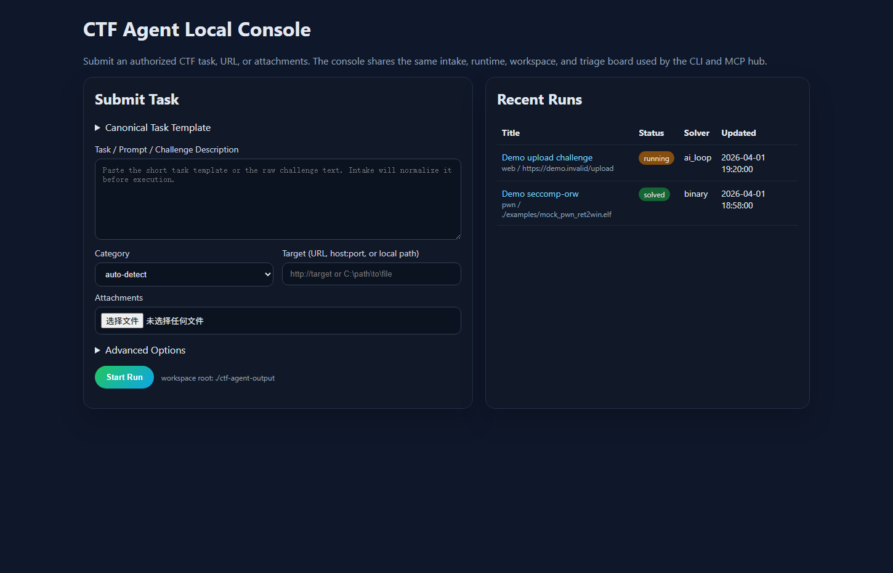
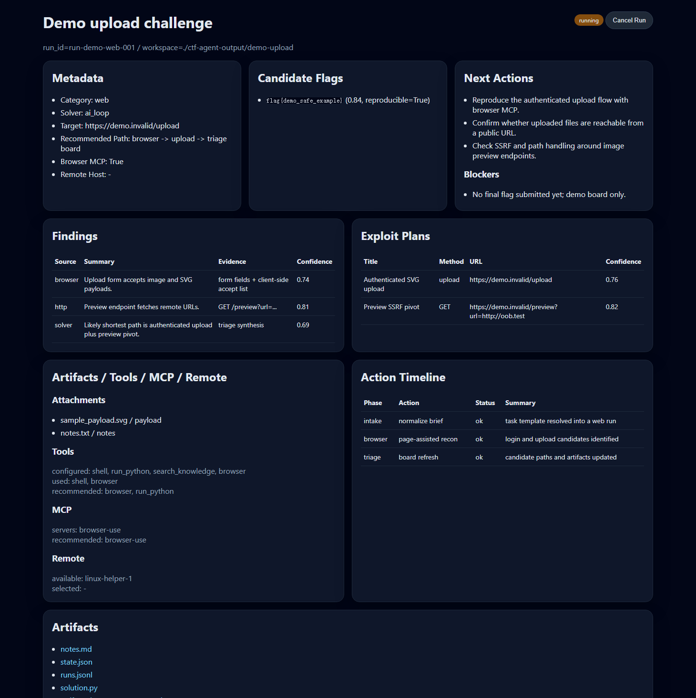

# CTF Agent

一个用于 CTF 的 agent，支持 `web`、`misc`、`reverse`、`pwn`、`crypto`、`osint` 方向，目前能力仍在持续完善。

This repository keeps a practical public edition of the agent runtime, with a single MCP hub, reproducible workspaces, embedded skills, solved export, and optional remote helpers.

## Why CTF Agent

- `ctf-agent` 是统一执行主体，复用同一套 CLI、MCP、Web console、workspace 和 triage board。
- 顶层入口收敛到 `ctf-agent-mcp`，把嵌套 MCP、工具链和远程能力统一到一个 hub 后面。
- 仓库内置 `embedded_ctf_skills`，开箱就有基础战术 playbook。
- 默认路径采用公开安全的相对目录，方便别人接入自己的 MCP、wiki 和 remote helper。

## Key Capabilities

| Area | Public Edition |
| --- | --- |
| Entry points | `ctf-agent`, `ctf-agent-mcp`, `ctf-agent-browser-mcp`, `ctf-agent serve-web` |
| Categories | `web`, `misc`, `reverse`, `pwn`, `crypto`, `osint` |
| Solver paths | AI loop, web solver, binary solver, specialized solvers |
| Knowledge | Embedded `ctf-skills` + optional `rag.wiki_root` |
| Pwn / Reverse | hard pwn families, remote helper interface, reverse MCP hooks |
| Outputs | `triage_board.json`, `task_protocol_summary.json`, `notes.md`, `solution.py`, solved export |
| Default public paths | `./ctf-agent-output`, `./ctf-toolkit`, `./agent-wp`, `./ctf-agent-wiki` |

Solved output contract:

- First line: `flag: ...`
- Second line: `wp_package_path: ...`
- Solved runs export `flag.txt`, `wp.md`, `poc.md`, `meta.json`, and `code/` under `./agent-wp/<category>_<title>_wp`

## Quick Start

```powershell
python -m pip install -e .
python -m pip install -e ".[web]"
Copy-Item .\local_config.example.json .\local_config.json

# Set your own OpenAI-compatible endpoint credentials first
$env:CTF_AGENT_LLM_API_KEY = 'your-key'
$env:CTF_AGENT_LLM_BASE_URL = 'https://api.example.com/v1'
$env:CTF_AGENT_LLM_MODEL = 'gpt-4o'

ctf-agent doctor --config .\local_config.json --workspace-root .\ctf-agent-output
ctf-agent-mcp
ctf-agent serve-web
```

最短公开工作流：

1. 复制 [local_config.example.json](local_config.example.json) 到本地 `local_config.json`
2. 填好 LLM、toolkit、可选 wiki 路径
3. 运行 `ctf-agent doctor`
4. 用编辑器连接 `ctf-agent-mcp`，或者直接启动 `ctf-agent serve-web`

更多配置说明：

- [Public Setup](docs/public_setup.md)
- [Editor Integration](docs/editor_integration.md)
- [Remote Helpers](docs/remote_helpers.md)
- [MCP Catalog](docs/mcp_catalog.md)
- [Solved Output](docs/solved_output.md)
- [Fastest Mode](docs/fastest_mode.md)

## Demo Workflow

```text
Authorized challenge
  -> ctf-agent-mcp / ctf-agent serve-web
  -> intake + router + solver runtime
  -> tools / MCP / optional remote helper
  -> triage_board.json + notes.md + artifacts
  -> solved export under ./agent-wp
```

推荐高层入口：

- `run_ctf_session`
- `continue_ctf_session`
- `auto_solve_ctf`
- `get_ctf_board_summary`

## Screenshots

下面三张图都来自公开安全 demo，不包含私有主机、私有工作区或真实目标信息。



_CLI / MCP / serve-web 入口能力面。_



_本地 Web console 首页，展示 intake 表单、recent runs 和 canonical task template。_



_Demo triage board，展示 findings、candidate flags、artifacts、next actions 和工具使用轨迹。_

## Architecture

```text
challenge -> intake/router/autopilot
          -> solver runtime
             |- AI loop (LLM + tools + code execution + reflection)
             |- Binary / web / specialized solvers
             |- MCP hub + local tools + optional remote helpers
             |- workspace artifacts
             `- solved export
```

统一产物：

- `notes.md`
- `state.json`
- `runs.jsonl`
- `solution.py`
- `triage_board.json`
- `task_protocol_summary.json`
- `artifacts/*`

## Knowledge Sources

- Embedded skills: [ctf_agent/knowledge/embedded_ctf_skills](ctf_agent/knowledge/embedded_ctf_skills)
- Optional personal wiki: configured through `rag.wiki_root`

公开仓库只内嵌 skills，不附带个人 wiki / writeup。

## Fastest Mode

触发关键词：

- `fastest`
- `最快`
- `搏一把`
- `speedrun`

命中后会优先走最短链路：

- 尽量跳过长链知识检索
- 不强制 preview / template 往返
- 输出更紧凑
- `pwn` 优先 remote-first

## Hard Pwn

- 运行时可以先输出 `pwn_family`，再输出当前 blocker / next step
- 已支持的 family 包括 `seccomp-orw`、`sandbox-orw`、`srop`、`ret2dlresolve`、`heap-*`、`fsop`、`shellcode-mmap`
- fastest 模式下，hard-pwn lane 保持短而有界

## Third-Party Attribution

This repository embeds the upstream `ctf-skills` knowledge pack inside `ctf_agent/knowledge/embedded_ctf_skills`.

- Source: [ljagiello/ctf-skills](https://github.com/ljagiello/ctf-skills)
- Upstream license: [MIT](https://raw.githubusercontent.com/ljagiello/ctf-skills/main/LICENSE)
- Local notice: [THIRD_PARTY_NOTICES.md](THIRD_PARTY_NOTICES.md)

The upstream `LICENSE` and `README.md` are preserved inside the embedded directory.

## Safety Boundary

- Only for authorized CTF, lab, and private research targets
- Do not commit `local_config.json`, remote credentials, personal wiki data, or sidecar environments
- Remote helpers and nested MCP servers are operator-managed integrations, not bundled secrets
